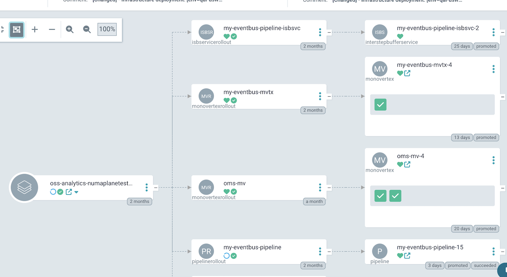
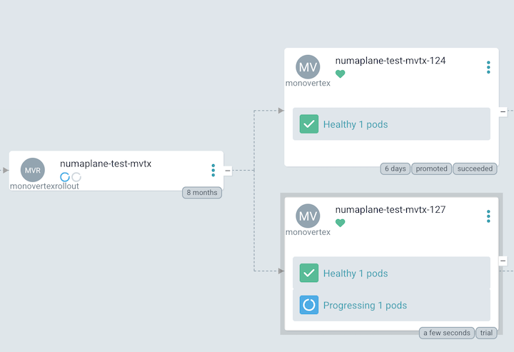
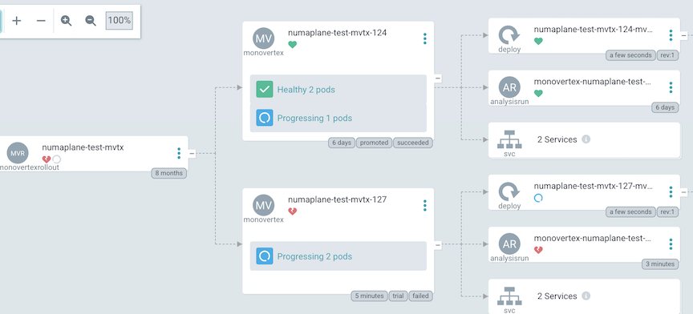
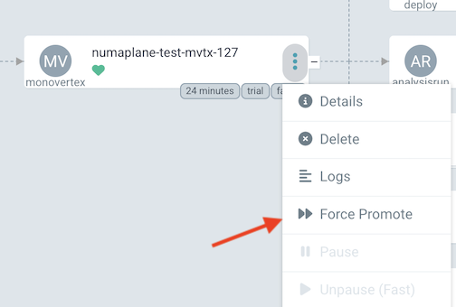
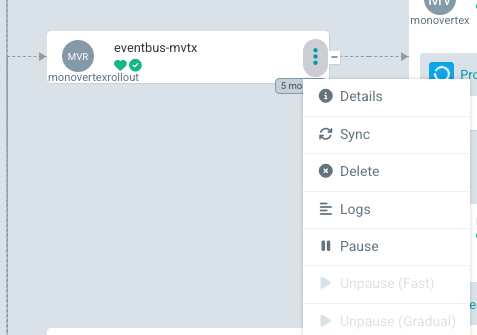

# ArgoCD Integration

Numaplane has been integrated into the ArgoCD ecosystem to provide a more complete end-to-end user experience. 

The Numaplane resources can all be deployed to a given user namespace through an ArgoCD `Application`.

Customizations have been added to ArgoCD so as to:
- Make it so that "Degraded" Status is appropriately reflected for Numaplane resources (which reflect the health of underlying Numaflow resources)
- Enable the user to take "Action" on the UI by clicking buttons such as "Force Promote"
- Show Labels to indicate the state of the underlying child resource: `promoted`, `trial`, `recyclable`
- and more

## Progressive Rollout

This is what the UI looks like when a given Numaplane resource is in a state of Progressive Rollout:

Here's what it looks like if the `AnalysisRun` deployed fails (note that it's a child of the MonoVertex/Pipeline):

ArgoCD enables viewing the Spec/Status of any Kubernetes resource, so you can view those as needed.

### Overriding a "Failure" decision

If a "Failure" decision is deemed incorrect, a user can override that decision by selecting the "Force Promote" menu item in ArgoCD on the new `MonoVertex` (the one with the "trial" label):

## Pausing a Pipeline/Monovertex

For users who need to pause their Pipeline or MonoVertex, they should modify the PipelineRollout/MonoVertexRollout spec to set `lifecycle.desiredPhase`: `Paused`. ArgoCD provides a button for this:

